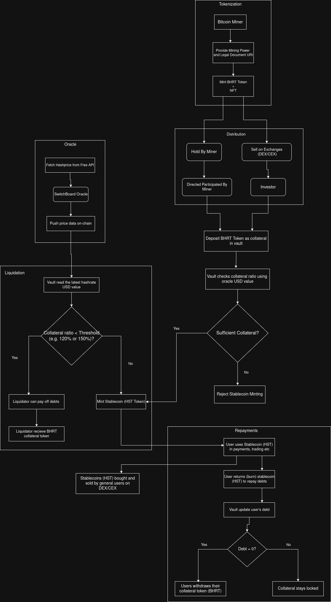

# HST Protocol: A Stablecoin Backed by Bitcoin Hashrate Derivatives

[](https://github.com)
[](https://opensource.org/licenses/MIT)
[](https://www.rust-lang.org/)
[](https://www.anchor-lang.com/)

A decentralized protocol on the Solana blockchain that allows Bitcoin miners to tokenize their hashrate for immediate liquidity and enables investors to mint a collateralized stablecoin.

## Table of Contents

-   [Project Overview](#project-overview)
-   [Core Concepts](#core-concepts)
    -   [Hashrate Tokenization (BHRT)](#hashrate-tokenization-bhrt)
    -   [The HST Stablecoin](#the-hst-stablecoin)
    -   [Collateralized Debt Position (CDP)](#collateralized-debt-position-cdp)
    -   [Liquidation Mechanism](#liquidation-mechanism)
-   [System Architecture](#system-architecture)
    -   [Protocol Flow Diagrams](#protocol-flow-diagrams)
-   [Program 1: BHRT Minter & AMM](#program-1-bhrt-minter--amm)
    -   [Instructions](#instructions)
-   [Program 2: HST Stablecoin Vault](#program-2-hst-stablecoin-vault)
    -   [Instructions](#instructions-1)
-   [Technology Stack](#technology-stack)
-   [Getting Started](#getting-started)

---

## Project Overview

The HST Protocol is designed to bridge the gap between Bitcoin's proof-of-work infrastructure and the DeFi ecosystem on Solana. The primary goal is to provide **Bitcoin miners** with a tool to hedge against future reward volatility by collateralizing their computational power (hashrate) for instant liquidity.

Miners enter a legal agreement to provide a specific hashrate (e.g., 0.1 TH/s). In return, the protocol mints a proportional amount of **Bitcoin Hashrate Reward Tokens (BHRT)**. These tokens represent a verifiable claim on the future Bitcoin mining rewards generated by that hashrate. Miners can then trade these BHRT tokens on a DEX or use them within the DeFi ecosystem.

Furthermore, the protocol introduces a stablecoin, the **Hashprice Standard Token (HST)**, which is pegged to the US Dollar. Investors can mint HST by depositing BHRT tokens into a smart contract vault, using a **Collateralized Debt Position (CDP)** model with an over-collateralization ratio of 150%. This creates a robust, decentralized stablecoin backed by a productive, real-world asset.

---

## Core Concepts

### Hashrate Tokenization (BHRT)

-   **Representation of Value**: Each BHRT is an SPL token that represents a legal and technical claim to the Bitcoin mining rewards produced by a standardized unit of hashrate (e.g., 0.1 TH/s).
-   **Onboarding**: A miner is onboarded through a verifiable process, including a legal contract that is represented on-chain by an NFT. This ensures that every BHRT token is backed by real, committed mining power.
-   **Liquidity**: Once minted, BHRT can be freely traded on the open market through the protocol's built-in AMM or other DEXs, providing miners with immediate capital.

### The HST Stablecoin

-   **USD Peg**: HST is a stablecoin designed to maintain a 1:1 peg with the US Dollar.
-   **Asset-Backed**: Unlike fiat-backed stablecoins, HST is backed by a decentralized portfolio of BHRT tokens, which are themselves backed by the productive capacity of the Bitcoin network.

### Collateralized Debt Position (CDP)

-   **Minting HST**: Users (investors or miners) can mint HST by locking their BHRT tokens in the protocol's vault. This action opens a CDP.
-   **Over-Collateralization**: To ensure stability and absorb the price volatility of BHRT, the protocol requires a **150% collateralization ratio**. This means for every $1 worth of HST a user wishes to mint, they must deposit at least $1.50 worth of BHRT.
-   **Debt Settlement**: To reclaim their BHRT collateral, users must repay the HST they minted. The repaid HST is then burned by the protocol, reducing the total supply and closing out the debt.

### Liquidation Mechanism

-   **Protocol Safety**: If the value of a user's BHRT collateral drops and their collateralization ratio falls **below 150%**, their position becomes eligible for liquidation.
-   **Liquidators**: Any user can act as a liquidator. They can repay the debt (partially or fully) of an under-collateralized position.
-   **Incentive**: As a reward for securing the protocol, the liquidator receives the seized BHRT collateral from the borrower's position, plus a **5% penalty reward**. This ensures there is a strong financial incentive for the community to keep the protocol solvent.

---

## System Architecture

The protocol is built on a two-program architecture to ensure a clear separation of concerns, enhancing security and modularity.

### Protocol Flow Diagrams

**Program Architecture Flow**: 
[View Interactive Diagram on Excalidraw](https://excalidraw.com/#json=abdWHsKJoT0tQJL2Jy3jG,cMDrSIMp_hA4xsUeMnHZIg)


**General Flow**


### [Program 1: BHRT Minter & AMM](./bhrt_token)

-   **ID**: `AbBt8CJq2PrE9WoDR5iSmJXxuFCGcs7PMKUuZKzVxFDD`
-   **Responsibility**: This program handles the entire lifecycle of the BHRT token. It manages miner onboarding, the minting of legal proof NFTs, the issuance of BHRT tokens, and provides an on-chain AMM for BHRT/USDT trading.

### [Program 2: HST Stablecoin Vault](./stablecoin)

-   **ID**: `CCLDZoaXu8EchMrVdVHokdyhBUGgHWBVguMibawESYJj`
-   **Responsibility**: This program manages the CDP protocol. It contains the vault logic for locking BHRT collateral, minting and burning the HST stablecoin, managing user debt positions, and handling liquidations.

---

## [Program 1: BHRT Minter & AMM](./bhrt_token)

This program is the foundation of the protocol, responsible for tokenizing real-world hashrate into on-chain assets.

### Instructions

```rust
// Program 1: bhrt_token
pub fn authorityinitialization(ctx: Context<Initialize>) -> Result<()>;
pub fn approve_miners(ctx: Context<ApproveMiner>, miner_to_add: Pubkey) -> Result<()>;
pub fn onboard_miner_nft(ctx: Context<OnboardMinerNFT>, nft_id: u64, name: String, uri: String) -> Result<()>;
pub fn onboard_miner_mint(ctx: Context<OnboardMinerMint>, nft_id: u64, mining_power: u64) -> Result<()>;
pub fn amm_initialize(ctx: Context<AmmInitialize>, fee: u16) -> Result<()>;
pub fn amm_deposit(ctx: Context<Deposit>, amount: u64, max_bhrt: u64, max_usdt: u64) -> Result<()>;
pub fn amm_withdraw(ctx: Context<Withdraw>, amount: u64, min_bhrt: u64, min_usdt: u64) -> Result<()>;
pub fn amm_swap(ctx: Context<Swap>, is_bhrt: bool, amount_in: u64, min_amount_out: u64) -> Result<()>;
pub fn revoke_miner_participation(ctx: Context<RevokeMinerParticipation>, nft_id: u64, amount: u64) -> Result<()>;
```

-   **`authorityinitialization`**: Initializes the program's global state and sets the administrative authority.
-   **`approve_miners`**: Allows the authority to whitelist a miner's public key, permitting them to be onboarded.
-   **`onboard_miner_nft`**: Creates the legal proof-of-commitment NFT for a newly approved miner, linking their wallet to a unique ID and the off-chain legal agreement URI.
-   **`onboard_miner_mint`**: Mints BHRT tokens to the miner's account, proportional to the amount of hashrate they have committed.
-   **`amm_initialize`**: Initializes the constant product AMM pool for a BHRT/USDT pair.
-   **`amm_deposit`**: Allows a user to deposit liquidity (BHRT and USDT) into the AMM and receive LP tokens.
-   **`amm_withdraw`**: Allows a user to burn their LP tokens to withdraw their proportional share of liquidity from the AMM.
-   **`amm_swap`**: Allows users to swap BHRT for USDT (or vice-versa) based on the constant product formula.
-   **`revoke_miner_participation`**: Allows a miner to end their commitment by returning their BHRT tokens to the protocol to be burned, thereby unlocking their hashrate.

---

## [Program 2: HST Stablecoin Vault](./stablecoin)

This program implements the over-collateralized stablecoin minting and risk management logic.

### Instructions

```rust
// Program 2: stablecoin
pub fn initialize_config_and_vault(ctx: Context<InitializeVault>, uri: String) -> Result<()>;
pub fn open_position(ctx: Context<OpenPosition>, collateral_amount: u64) -> Result<()>;
pub fn liquidate(ctx: Context<Liquidation>, liquidation_amount: u64) -> Result<()>;
pub fn position_debt_settlement(ctx: Context<PositionDebtSettlement>, debt_amount: u64) -> Result<()>;
```
-   **`initialize_config_and_vault`**: Sets up the global configuration for the stablecoin protocol, including creating the HST mint and the collateral vault PDA.
-   **`open_position`**: Allows a user to deposit BHRT collateral into the vault, open a new debt position (CDP), and mint HST stablecoins according to the 150% collateralization ratio.
-   **`liquidate`**: Allows a liquidator to repay the HST debt of an under-collateralized position and claim the BHRT collateral plus the 5% penalty.
-   **`position_debt_settlement`**: Allows a borrower to repay their minted HST. The protocol burns the repaid stablecoins and returns the corresponding BHRT collateral to the user.

---

## Technology Stack

-   **Blockchain**: Solana
-   **Framework**: Anchor
-   **Language**: Rust
-   **Oracles**: Switchboard (for live price feeds)
-   **NFTs**: Metaplex (for NFT minting)
-   **Tokens**: Solana Token-2022 Program

---

## Getting Started

To set up the project locally for development and testing:

1.  **Clone the repository:**
    ```sh
    git clone <your-repo-url>
    cd <your-repo-name>
    ```
2.  **Install dependencies:**
    Ensure you have the Rust toolchain, Solana CLI, and Anchor framework installed.
3.  **Build the programs:**
    ```sh
    anchor build
    ```
4.  **Run tests:**
    ```sh
    anchor test
    ```
5.  **Deploy to a local ledger or devnet:**
    ```sh
    anchor deploy
    ```